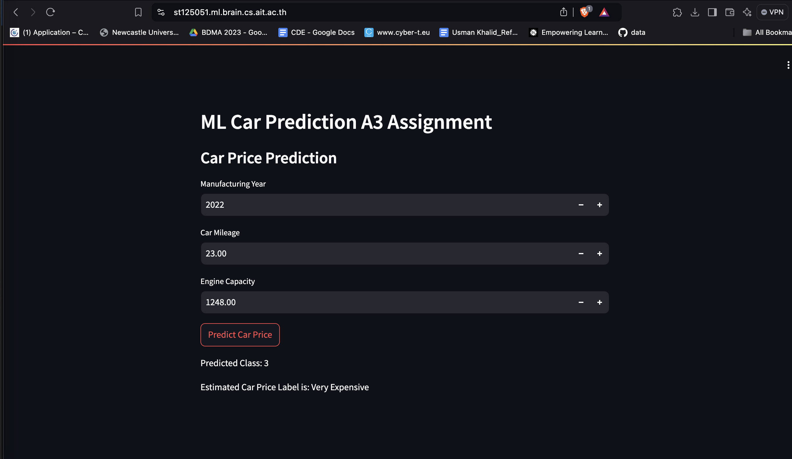

# Project Overview

This project focuses on predicting car prices using **Logistic Regression**. The model's performance has been evaluated using precision, recall, and the F1-score. The goal is to identify the best model for car price prediction.

### Best Model:
- **Regularization**: Ridge
- **Method**: Mini-batch Gradient Descent
- **Final Training Loss**: 0.9015

### Clone Repository
To get started, clone or download the repository from GitHub to your local machine:

[GitHub Repository](https://github.com/AIT-MachineLearning/a3-predicting-car-price-usmankhalid-95.git)

### Predicting Car Prices
You can predict car prices using the web interface at the following link:

[Predict Car Prices](https://st125051.ml.brain.cs.ait.ac.th/)

### Parameters Used for Prediction:
- Manufacturing Year
- Car Mileage
- Engine Capacity

